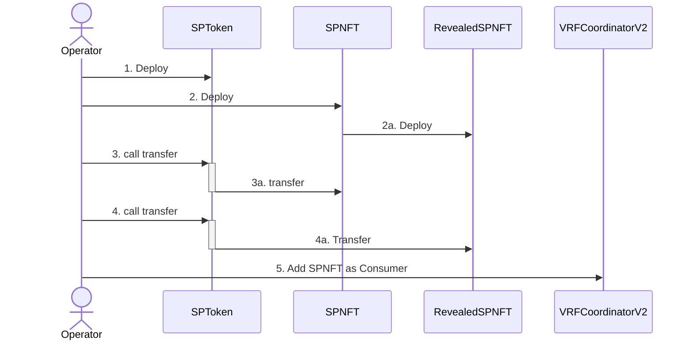
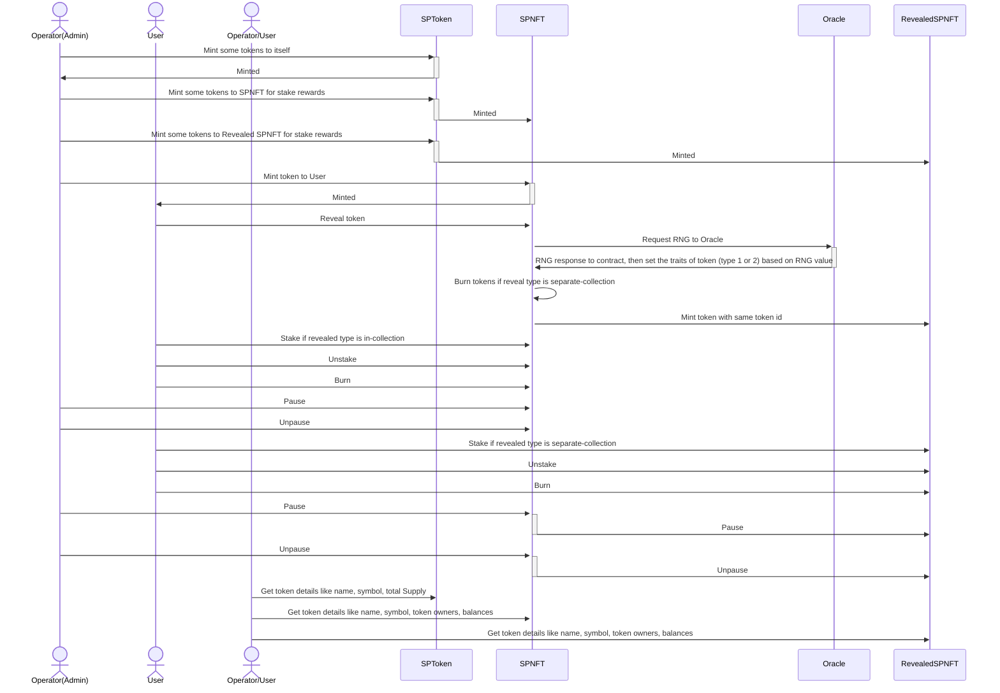
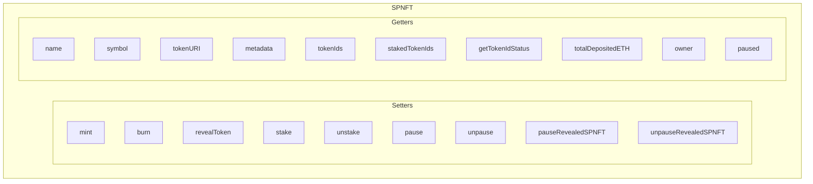
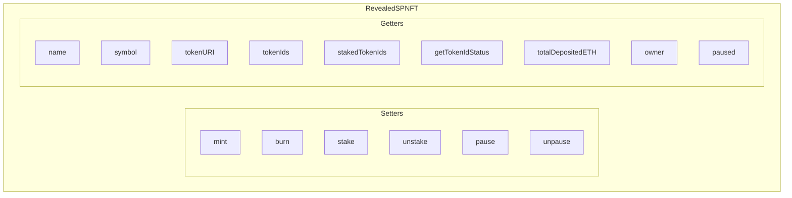

## Architecture

**Deployment of the project is done in 5 steps**:

1. Deploy `token` contract.
2. Deploy `SPNFT` contract.
   > `RevealedSPNFT` contract is deployed by `SPNFT` contract.
3. Transfer some tokens to `SPNFT` contract for stake rewards.
4. Transfer some tokens to `RevealedSPNFT` contract for stake rewards.
5. Add `SPNFT` contract as consumer in `VRFCoordinatorV2` contract.
   > NOT considered as deployment script because it exceeded deployment gas limit (~800,000 unit). So, needs to be done externally from [here](https://vrf.chain.link/sepolia/4562).

So, actually [1], [2], [3], [4].

Here is the diagram:

---

**User workflow**:

- Mint token to an address in `SPNFT` contract.
- Reveal token in `SPNFT` contract.
- Stake token in `SPNFT` contract.
- Unstake token in `SPNFT` contract.
- Burn token in `SPNFT` contract.
- Pause/Unpause `SPNFT` contract.
- Pause/Unpause `RevealedSPNFT` contract.
- Mint token to an address in `RevealedSPNFT` contract.
- Stake token in `RevealedSPNFT` contract.
- Unstake token in `RevealedSPNFT` contract.
- Burn token in `RevealedSPNFT` contract.
- Pause/Unpause `RevealedSPNFT` contract.
- Get token details in `SPNFT` contract.
- Get token details in `RevealedSPNFT` contract.
- Get token details in `SPToken` contract.

---

**Main functions in `SPNFT` contract**:

---

**Main functions in `RevealedSPNFT` contract**:

